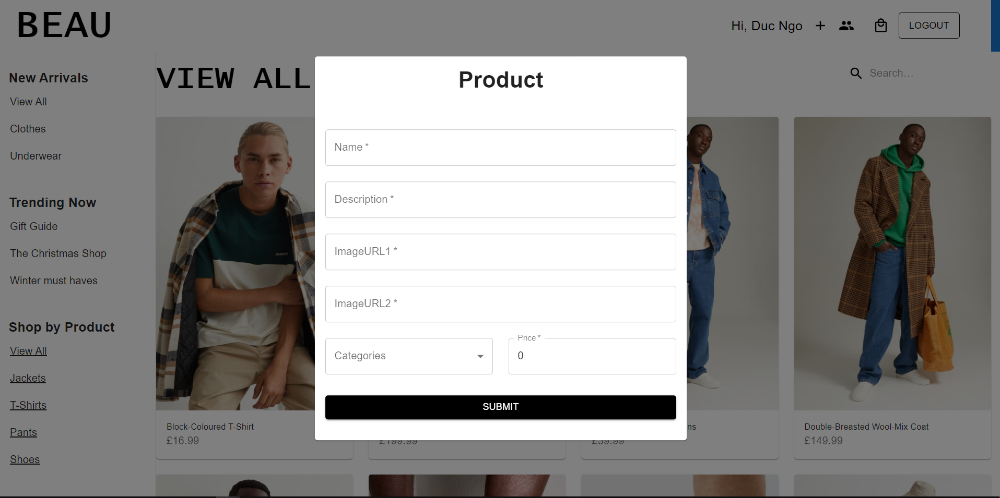
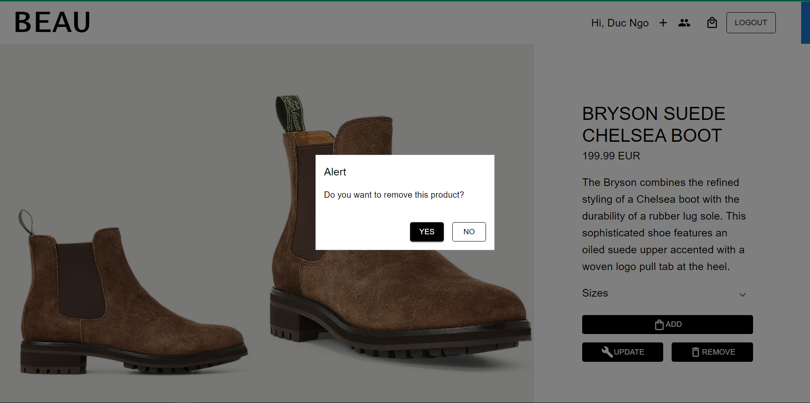
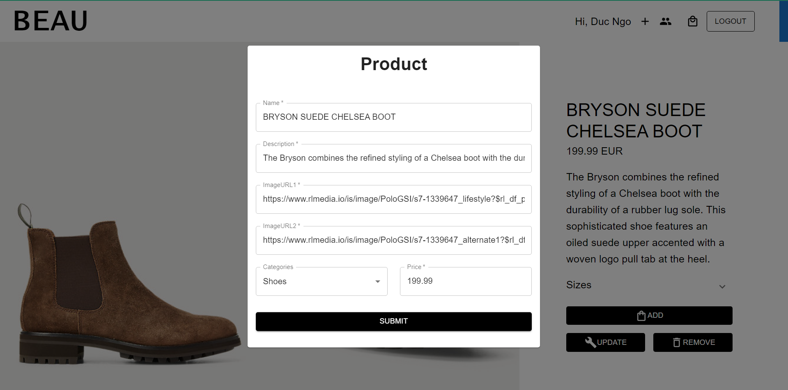
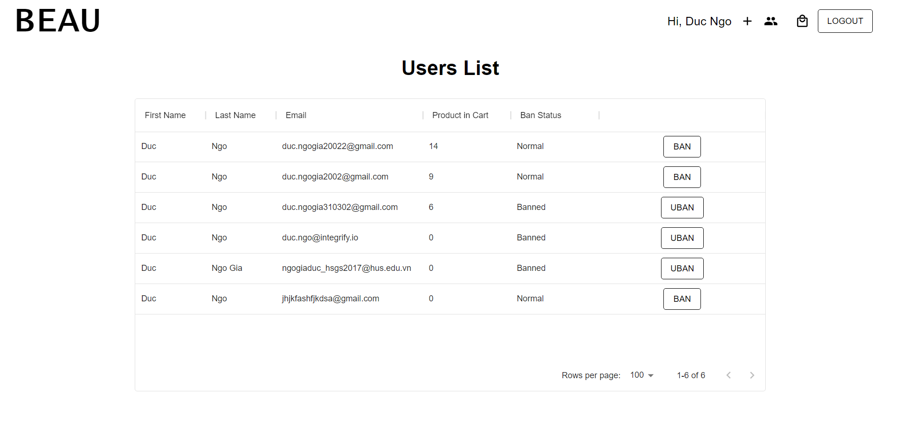

# BeauClothing-E-Commerce-Backend# WEAR E-Commerce Clothing Site

- A well-designed MERN(MongoDB, Express.js, React, Node.js) Stack Application E-Commerce website in clothing fashion inspired by H&M.
- Demo link: https://beau-ecommerce-project-duc-ngo.netlify.app/
- Link to Frontend source code: https://github.com/DwcQuocXa/BeauClothing-E-Commerce-Frontend

# Features

- User Sign Up and Sign In
- User Login System with Google
- Protected Admin/User routes in both front-end and back-end
- Remain logged-in while refresh with JWT token and Local Storage
- User can add items to Cart
- User can increase/decrease the quantity of an item in Cart
- User can delete items in Cart
- Admin can create new items
- Admin can ban an user, make that user can no longer log in to the system

# Technologies

- TypeScript
- React
- Redux, Redux-thunk, Redux-Saga
- Material-UI
- Formik
- React-router-dom
- Node.js
- Express.js
- REST API
- MongoDB
- Mongoose
- jsonwebtoken
- Passport
- Well-tested unit tests with Jest

# Images from Admin Features

